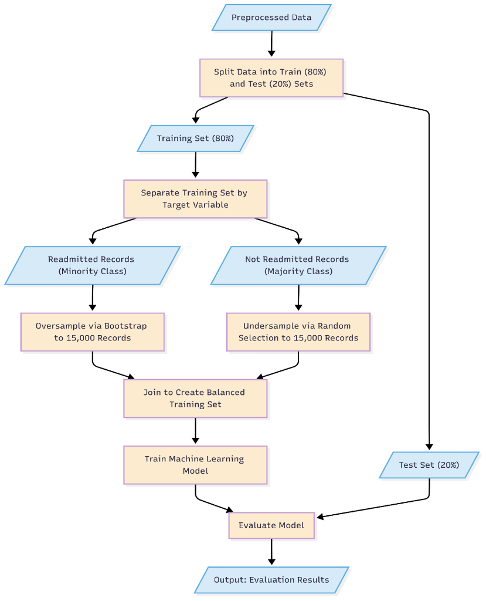

# Early Prediction of 30-Day All-Cause Hospital Readmissions


## 🏥 Project Overview
**Solving the "Timeliness vs. Accuracy" Dilemma in Healthcare AI**

Hospitals face a critical operational paradox: the most accurate readmission prediction models rely on discharge summaries and billing codes that are only available *after* a patient has left the hospital—too late for meaningful intervention.

This project challenges that status quo by validating a **"Minimal Data" paradigm**. We demonstrate that high-value predictive signals can be extracted from the first few diagnosis codes recorded **at the moment of admission**, enabling a truly proactive early-warning system that empowers clinicians to intervene *during* the patient's stay.

> **📄 Research Status:** The research paper detailing these findings is currently under review at a **Q1 Healthcare Analytics Journal**.
>
> [**➡️ Read the Full Research Paper**](Research_paper.pdf)

---

## 💡 Key Research Findings

### 1. Performance Parity: Early Data ≈ Late Data
Our rigorous analysis of 50,000 patient encounters revealed a groundbreaking insight: **models trained on minimal early-admission data perform on par with those using comprehensive post-discharge records.**
*   *implication:* Additional late-stage administrative data often acts as statistical noise rather than signal.

### 2. Transformer Superiority
The **DistilBERT** model, fine-tuned on clinical code sequences treated as "patient narratives," achieved the highest clinical utility (F1-score) on the minimal dataset.
*   *Innovation:* It successfully learned deep contextual relationships between diagnoses without needing complex engineered features.

### 3. Immediate Actionability
By shifting the prediction window to the point of entry, this approach transforms retrospective reporting into **real-time clinical decision support**, minimizing the "Actionability Gap" inherent in traditional risk scoring.

---

## 💻 Technology Stack

This project showcases advanced proficiency in the modern Python Data Science & AI ecosystem:

*   **Deep Learning & NLP**: `PyTorch`, `Transformers` (Hugging Face), `DistilBERT`
*   **Machine Learning**: `scikit-learn`, `CatBoost`
*   **Data Engineering**: `Pandas`, `NumPy`
*   **Visualization**: `Matplotlib`, `Seaborn`

---

## 🛠 Methodology & Architecture

### Models Evaluated
We benchmarked four distinct architectures to assess signal extraction capabilities:

1.  **Random Forest**: Baseline for interpretability and feature importance.
2.  **CatBoost**: Advanced Gradient Boosting optimized for high-cardinality categorical medical codes.
3.  **Multi-Layer Perceptron (MLP)**: Deep learning approach utilizing **Entity Embeddings** to learn latent representations of medical conditions.
4.  **DistilBERT (Transformer)**: State-of-the-art NLP model fine-tuned to treat the sequence of ICD-10 diagnosis codes as a textual narrative, capturing the full context of a patient's admission.

### Data Source
*   **Dataset:** 50,000 de-identified inpatient encounters from the **2019 New York State Emergency Department Database**.
*   **Exclusions:** Discharge Against Medical Advice (DAMA) to focus on preventable readmissions.

### Experimental Pipeline
We implemented a robust end-to-end ML pipeline designed for rigorous validation:



---

## 👨‍💻 About the Author

This project was architected and implemented by **Ritam Ghosh** as part of advanced research in **Healthcare Informatics**. It demonstrates a full-spectrum skillset:
*   **End-to-End ML Ops**: From raw administrative data to deployable model artifacts.
*   **Advanced NLP Application**: Novel application of Language Models (LLMs) to structured tabular medical data.
*   **Rigorous Academic Research**: Methodological design, statistical validation, and scientific writing.

For more details on the implementation, please refer to the `code/` directory or the full [**Research Paper**](Research_paper.pdf).

---

## 📂 File Structure

```
Readmissions_Research/
├── Research_paper.pdf       # The core research paper detailing findings
├── README.md                # Project documentation
├── assets/                  # Images and diagrams
├── data/                    # Data directory (original and preprocessed)
└── code/                    # Source code for the project
    ├── models/              # Machine Learning model implementations
    │   ├── rf_model.py          # Random Forest
    │   ├── catboost_model.py    # CatBoost
    │   ├── mlp_model.py         # Multi-Layer Perceptron (PyTorch)
    │   └── distilbert.../       # Transformer-based models
    ├── analytics/           # Exploratory Data Analysis & Statistics
    └── preprocessing.py     # Data cleaning and feature engineering pipeline
```
